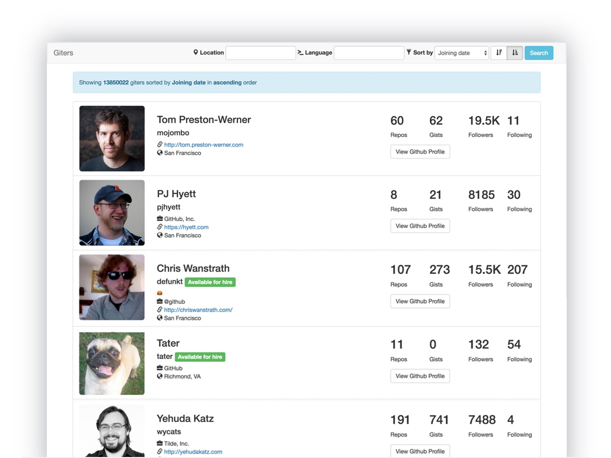

# giters
Git(hub)ers search interface

[](https://travis-ci.org/Praseetha-KR/giters) [](https://coveralls.io/github/Praseetha-KR/giters?branch=master)

Search Giters based on **location** & **language**, sort by **repositories count**/**followers count**/**joining date** in **asc**/**desc** order.

Implemented with AngularJS (1.5.*)

###How to setup & run
```
npm install
bower install
```
```
gulp
```
Now listen on [http://localhost:9999/build/#/users](http://localhost:9999/build/#/users)



